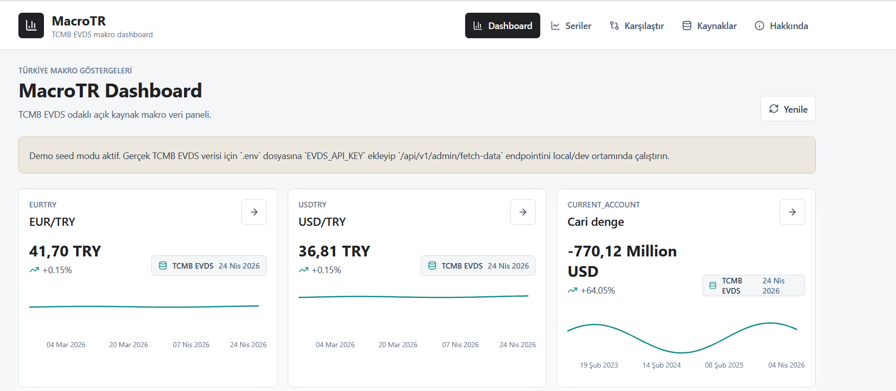
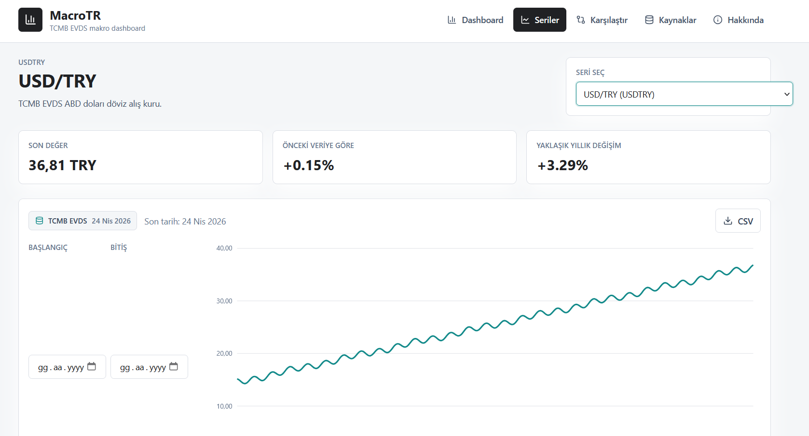
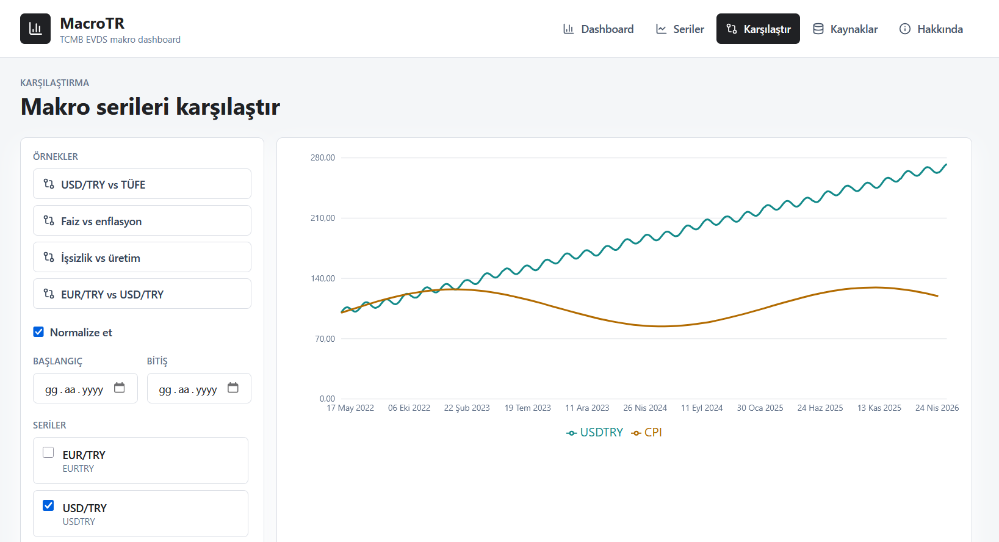

# MacroTR

Open-source Turkish macroeconomic data dashboard powered by TCMB EVDS, FastAPI, React, PostgreSQL and Redis.

> MacroTR is built for educational and informational purposes only. It does not provide investment advice, trading signals, or financial advisory services. Data is provided as-is from public or third-party sources without any guarantee of accuracy.

[Türkçe README](README.tr.md)

## Screenshots







## Features

- TCMB EVDS-focused macroeconomic dashboard
- FastAPI backend with documented `/api/v1` endpoints
- React, Vite, TypeScript, Tailwind CSS and Recharts frontend
- PostgreSQL storage for series and observations
- Redis-ready cache service
- Demo seed mode when `EVDS_API_KEY` is not configured
- Real EVDS ingestion when `EVDS_API_KEY` is configured
- Series detail pages with date range filtering and CSV export
- Compare page with normalized/raw mode and preset comparisons
- Backend and frontend tests
- Docker Compose for one-command local setup

## Tech Stack

- Backend: Python, FastAPI, Pydantic, SQLAlchemy, Alembic
- Frontend: React, Vite, TypeScript, Tailwind CSS, Recharts, TanStack Query
- Database: PostgreSQL
- Cache: Redis
- Deployment targets: Vercel, Railway, Render, Fly.io, Neon, Supabase

## Quickstart

```bash
cp .env.example .env
docker compose up --build -d
```

Open:

- Frontend: http://localhost:5173
- Backend API: http://localhost:8010
- Swagger: http://localhost:8010/docs

Stop:

```bash
docker compose down
```

## Environment Variables

| Variable | Purpose |
| --- | --- |
| `APP_ENV` | `development` or `production` |
| `DATABASE_URL` | PostgreSQL connection URL |
| `REDIS_URL` | Optional Redis connection URL |
| `EVDS_API_KEY` | TCMB EVDS API key (optional) |
| `SEED_SAMPLE_DATA` | Enables local demo observations |
| `ALLOWED_ORIGINS` | CORS origins |
| `VITE_API_BASE_URL` | Frontend API base URL |
| `BACKEND_PORT` | Local backend host port, default `8010` |
| `FRONTEND_PORT` | Local frontend host port, default `5173` |

## EVDS API Key

MacroTR works without an EVDS key by using deterministic local demo data.

To fetch real TCMB EVDS data:

1. Create an API key at https://evds2.tcmb.gov.tr.
2. Add it to `.env`:

```env
EVDS_API_KEY=your-key
SEED_SAMPLE_DATA=false
```

3. Restart the stack and trigger local/dev ingestion:

```bash
docker compose up --build -d
curl -X POST "http://localhost:8010/api/v1/admin/fetch-data"
```

`POST /api/v1/admin/fetch-data` is disabled automatically when `APP_ENV=production`.

## API Endpoints

- `GET /api/v1/health`
- `GET /api/v1/series`
- `GET /api/v1/series/{code}`
- `GET /api/v1/series/{code}/observations`
- `GET /api/v1/series/{code}/latest`
- `GET /api/v1/dashboard/summary`
- `GET /api/v1/compare?series=USDTRY,CPI`
- `POST /api/v1/admin/fetch-data`

See [API Reference](docs/api-reference.md) for full documentation and example responses.

## Tests

Backend:

```bash
pip install -r backend/requirements.txt
ruff check backend/app backend/tests scripts
pytest
```

Frontend:

```bash
cd frontend
npm install
npm run test
npm run build
```

## Deployment

Frontend can be deployed to Vercel with `frontend` as the project root and `VITE_API_BASE_URL` pointing to the backend.

Backend can be deployed to Railway, Render or Fly.io using `backend/Dockerfile`. Use managed PostgreSQL from Neon, Supabase, Railway or Render.

See [Deployment](docs/deployment.md).

## Data Sources

The MVP focuses on TCMB EVDS. Future versions may add TÜİK, World Bank, FRED, BIST or gold/FX providers.

See [Data Sources](docs/data-sources.md).

## Documentation

- [Architecture](docs/architecture.md)
- [Data Sources](docs/data-sources.md)
- [API Reference](docs/api-reference.md)
- [Deployment](docs/deployment.md)
- [Open Source Guide](docs/open-source-guide.md)
- [Security Notes](docs/security-notes.md)
- [Roadmap](ROADMAP.md)

## Disclaimer

MacroTR is built for educational and informational purposes only. It does not provide investment advice, trading signals, or financial advisory services. Data is provided as-is from public or third-party sources without any guarantee of accuracy.

## Contributing

Contributions are welcome. Start with [CONTRIBUTING.md](CONTRIBUTING.md) and the good first issues in [Open Source Guide](docs/open-source-guide.md).

## License

MIT. See [LICENSE](LICENSE).
